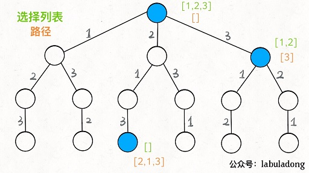

# 阿里二面
bert模型：
https://www.jianshu.com/p/d110d0c13063

 # 京东一面

 -  全排列

> 回溯法：为了避免生成那些不可能产生最佳解的问题状态，要不断地利用限界函数(bounding function)来处死那些实际上不可能产生所需解的活结点，以减少问题的计算量。这种具有限界函数的深度优先生成法称为回溯法。
解决一个回溯问题，实际上就是一个决策树的遍历过程。只需要思考 3 个问题：
	路径：也就是已经做出的选择。
	选择列表：也就是你当前可以做的选择。
	结束条件：也就是到达决策树底层，无法再做选择的条件。
	回溯算法的框架：
result = []
def backtrack(路径, 选择列表):
    if 满足结束条件:
        result.add(路径)
        return

    for 选择 in 选择列表:
        做选择
        backtrack(路径, 选择列表)
        撤销选择
其核心就是 for 循环里面的递归，在递归调用之前「做选择」，在递归调用之后「撤销选择」

> :


track.push_back(i);
backtrack(result, track, nums);
track.pop_back();
这三句话核心
把当前的元素放进来，递归去加入后面的，递归出来后，把当前的元素弹掉

前面定义的 backtrack 函数其实就像一个指针，在这棵树上游走，同时要正确维护每个节点的属性，每当走到树的底层，其「路径」就是一个全排列。

``` javascript
// # # # // #给定一个 没有重复 数字的序列，返回其所有可能的全排列。
// # # # // #数据结构算法都由自己完成

// # echo "hello world"
// #给定一个 没有重复 数字的序列，返回其所有可能的全排列。
// # # # // #数据结构算法都由自己完成
// for i in range(3):
//   print('hello world')

// 你必须定义一个 `main()` 函数入口。
#include <iostream>
#include <vector>
#include <algorithm>
using namespace std;

void mytraceback(vector<vector<int>>&result,vector<int>&mytrack,vector<int>&nums){
  if(mytrack.size()==nums.size()){
    result.push_back(mytrack);return;
  }
  for(int i=0;i<nums.size();i++){
    if(find(mytrack.begin(),mytrack.end(),i)!=mytrack.end()) continue;
    mytrack.push_back(i);
    mytraceback(result,mytrack,nums);
    mytrack.pop_back();
  }
}

vector<vector<int>>mypermute(vector<int>&nums){
  vector<vector<int>>result;
  vector<int>track;
  mytraceback(result,track,nums);
  return result;
}
 
int main()
{      
    vector<int> myarray={1,2,3,4,5};
    vector<vector<int>>myresult=mypermute(myarray);
    for(int i=0;i<myresult.size();i++){
      for(int num:myresult[i]){
        cout<<num<<" ";
      }
      cout<<endl;
    }
   
    return 0;
}
```

 - 优化器
	SGD ，Adam,Momentum
	https://www.cnblogs.com/guoyaohua/p/8542554.html


 - 防止过拟合
   
	batchnorm（四个步骤）https://blog.csdn.net/wzy_zju/article/details/81262453
	group norm：https://blog.csdn.net/weixin_41595062/article/details/88599104
	L1，L2正则 
	warmup：lr
	mixup
	https://blog.csdn.net/u013841196/article/details/81049968
	https://www.jianshu.com/p/d22fcd86f36d


